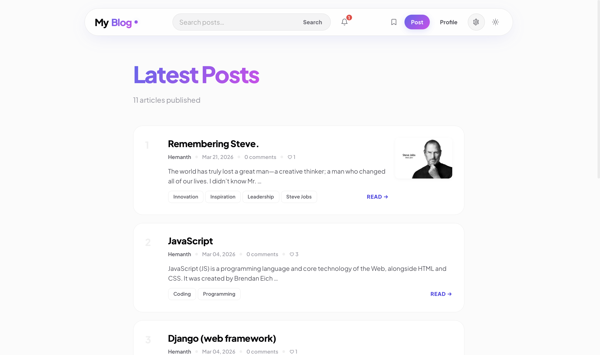
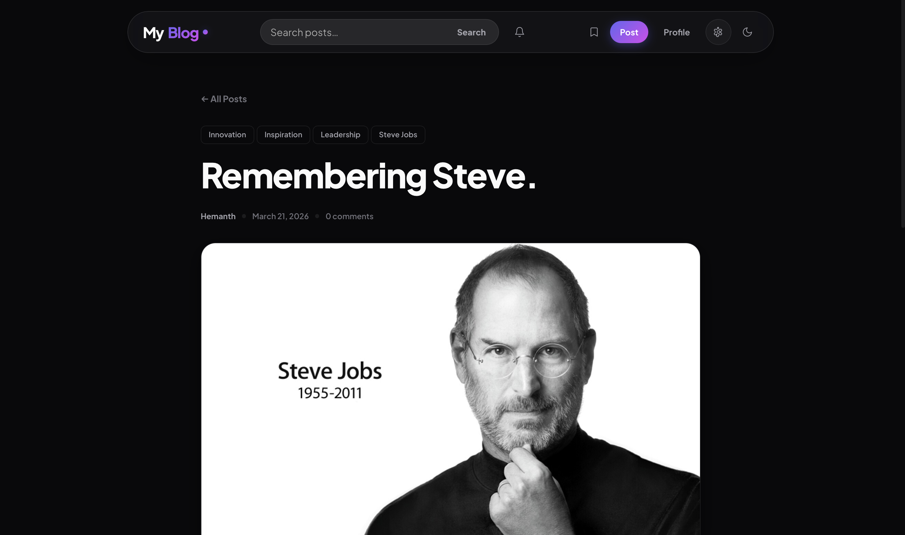
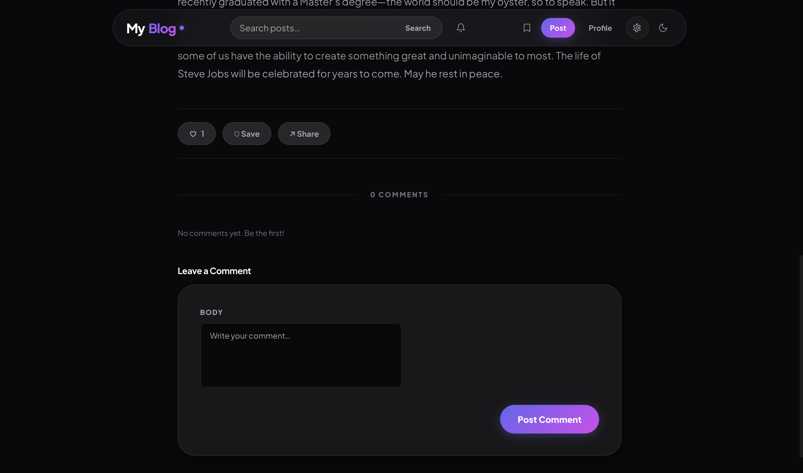
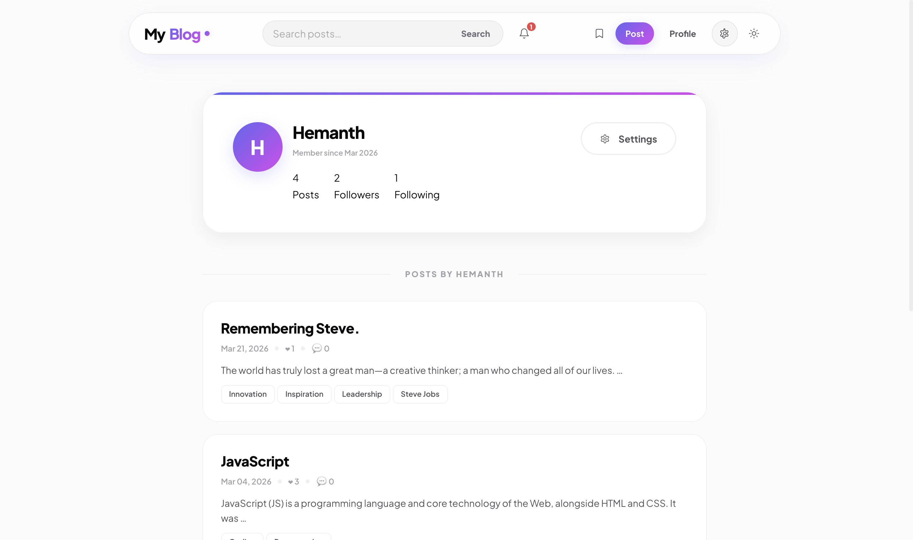
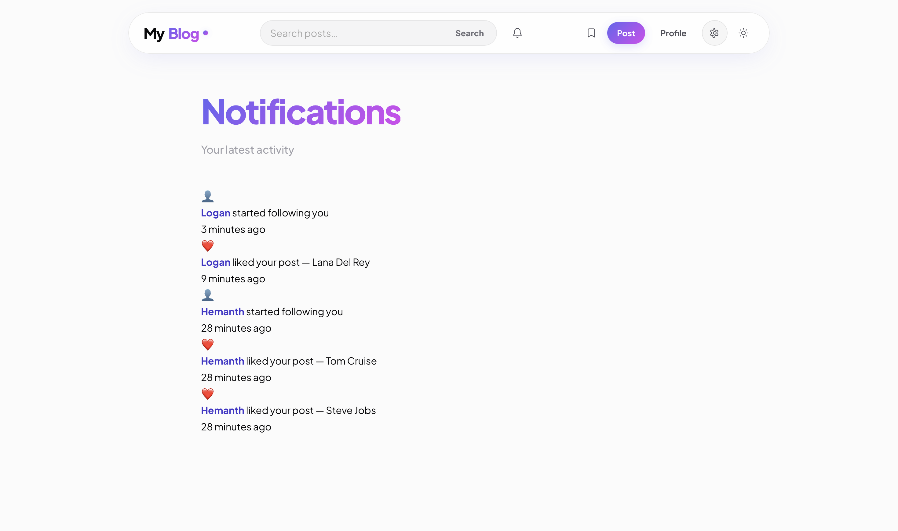
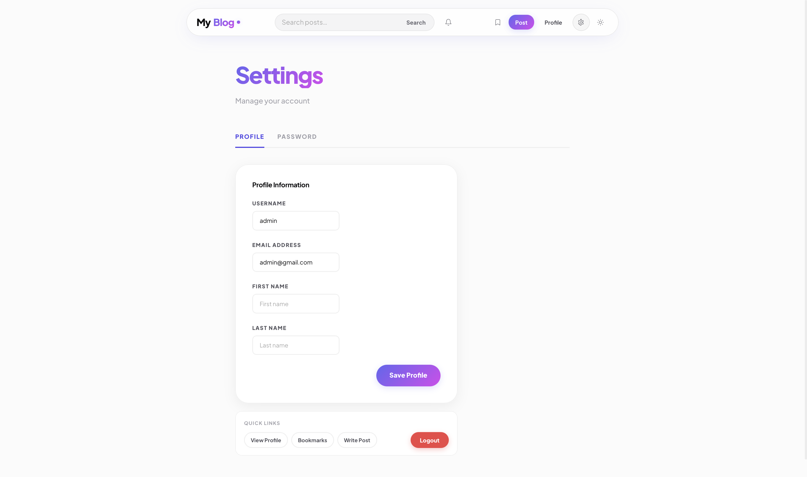

# DevBlog 🚀

A full-featured blogging platform built with Django, designed with a modern UI and social interaction features.

---

## ✨ Features
- User Authentication (Login / Signup)
- Email OTP Verification
- Create, Edit, Delete Posts
- Like & 🔖 Bookmark System
- Follow Users
- Notifications System
- Search & Tag Filtering
- Dark / Light Theme UI
- Comments System

---

## 🛠 Tech Stack
- Python
- Django
- SQLite
- HTML, CSS (Custom UI)
- JavaScript (AJAX)

---

## 📸 Screenshots

### 🏠 Home Page


### 📄 Post Detail



### 👤 Profile Page


### 🔔 Notifications Page


### ⚙️ Settings Page


---

## ⚙️ Setup

```bash
git clone https://github.com/hemanthchowdary1/postcraft-bloggingPlatform.git
cd post_craft
python -m venv venv
source venv/bin/activate      # Mac/Linux
venv\Scripts\activate         # Windows

pip install -r requirements.txt

python manage.py migrate
python manage.py runserver
```